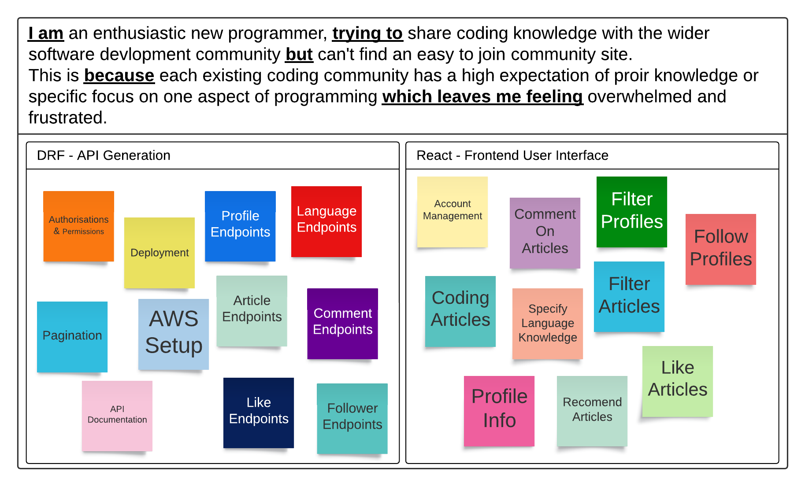
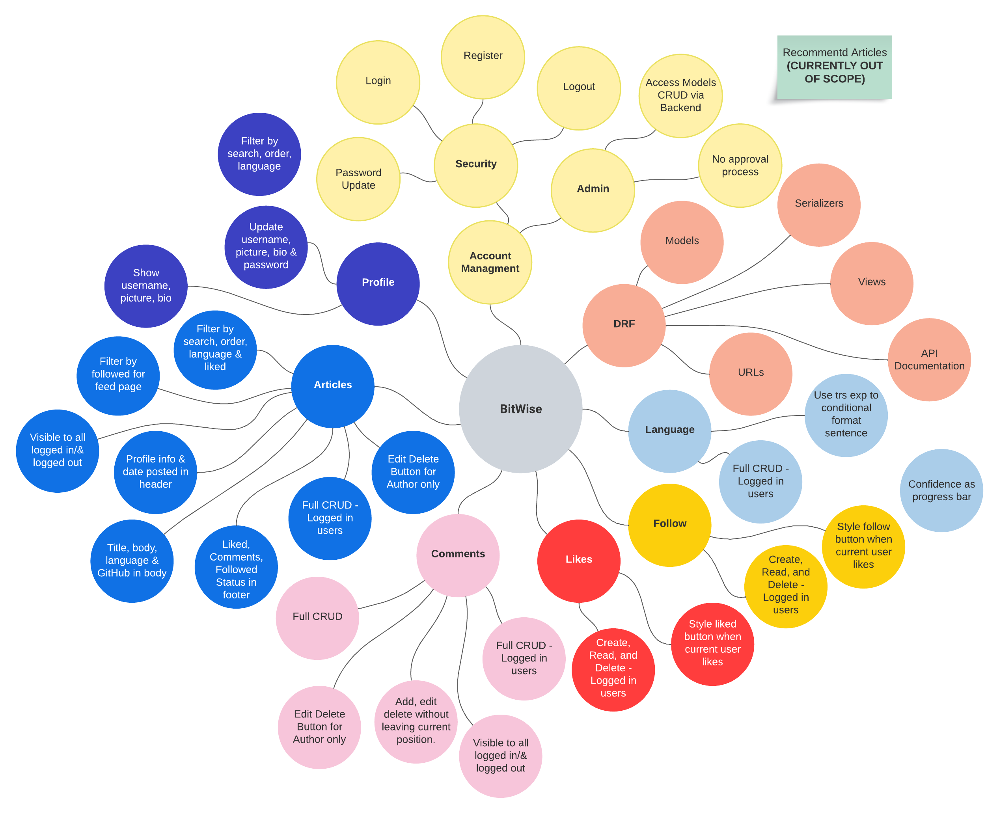
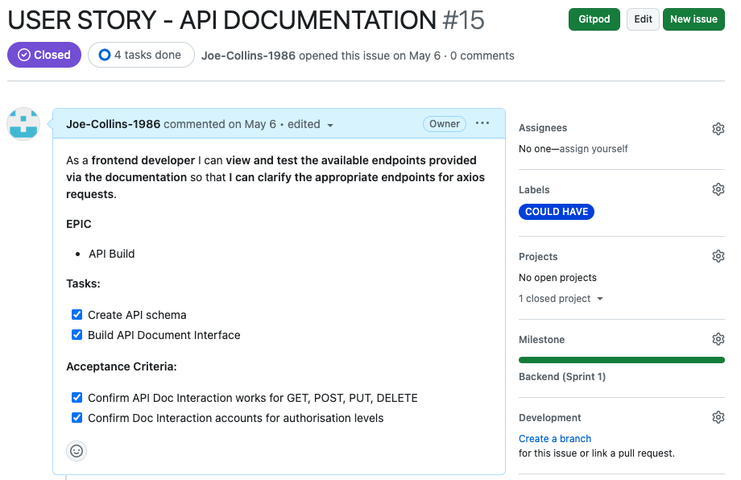
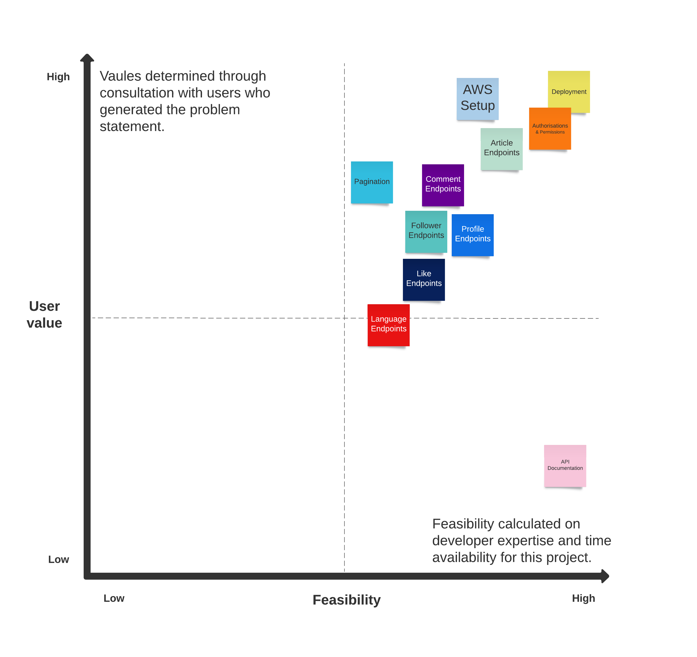
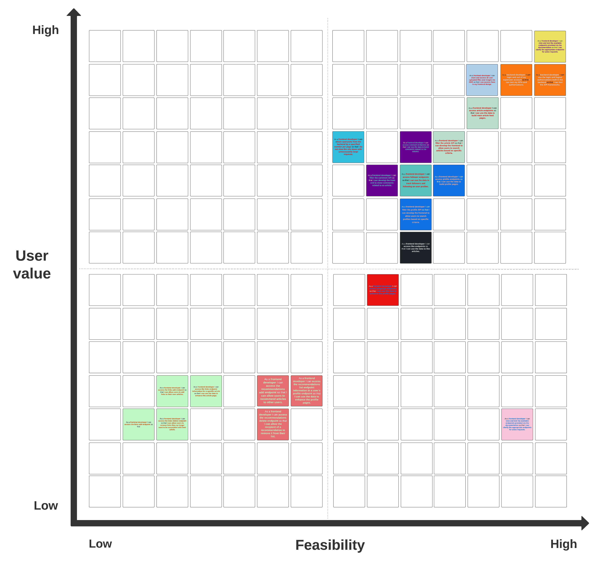
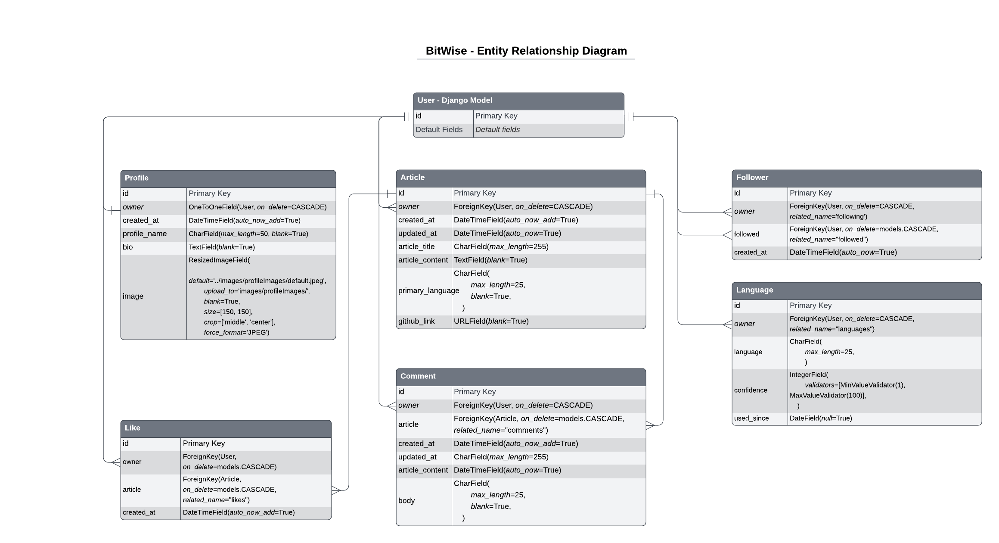
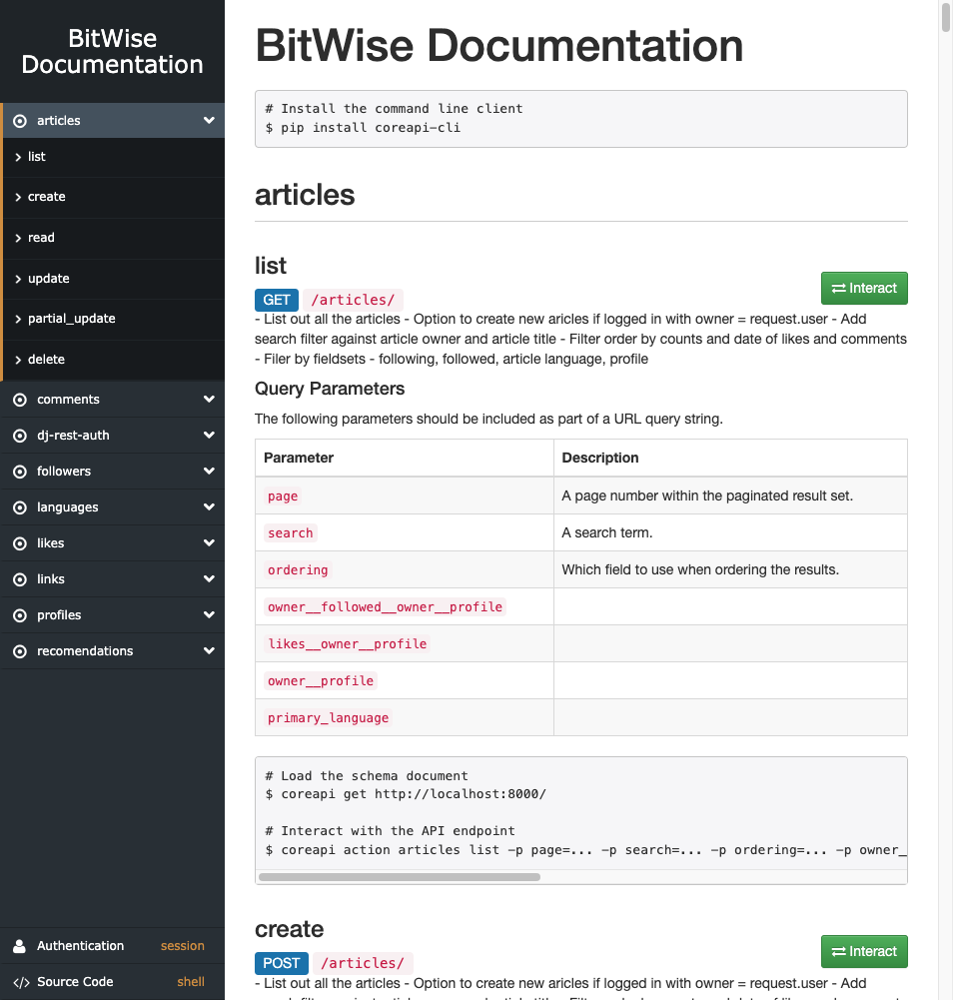

# BitWise - API

# Table Of Contents

- [Bitwise Site Links](#bitwise-site-links)
  - [Live API](#live-api)
  - [Live BitWise Site](#live-bitwise-site)
  - [Frontend Repo](#frontend-repo)
- [Bitwise Backend Overview](#bitwise-backend-overview)
  - [Project Introduction](#project-introduction)
- [Project Planning](#project-planning)
  - [Problem Statement](#problem-statement)
  - [Mind Map](#mind-map)
  - [API Objectives](#api-objectives)
  - [User Stories](#user-stories)
  - [Priority Matrix](#priority-matrix)
  - [Entity Relationship Diagram](#entity-relationship-diagram)
  - [Agile Methodology](#agile-methodology)
- [API Build](#api-build)
  - [Models](#models)
  - [Views](#views)
  - [Serializers](#serializers)
  - [Permissons](#permissons)
  - [CRUD - Endpoint Map](#crud---endpoint-map)
- [Further Development]
- [Technologies Used]
  - [Languages Used]
  - [Frameworks Used]
  - [Libraries Used]
  - [Developer Tools]
- [Testing]
  - [Testing Document]
  - [Further Testing]
  - [Development Bugs]
  - [Key Learns]
- [Deployment](#deployment)
  - [Deployment Document](#deployment-document)
- [Credits]
  - [Development Resources]
  - [Media and Content Resources]
  - [Acknowledgements]

 

# Bitwise Site Links

## [Live API](https://bitwise-code-blog.herokuapp.com/#languages-update)

## [Live BitWise Site](https://bit-wise-front-end.vercel.app/)

## [Frontend Repo](https://github.com/Joe-Collins-1986/BitWise-Front-End)

 

# Bitwise Backend Overview

## Project Introduction

**Note:** For the purpose of this project a fictitious client has been generated to provide scope for:

- testing my API devlopment utilising Python through the use of a Django REST Framework (DRF).
- testing my Frontend development utilising HTML, CSS and JavaScript through the use of React (for more information on the frontend development visit my [BitWise Frontend Repo](https://github.com/Joe-Collins-1986/BitWise-Front-End))

The backend for this BitWise project has been developed with Django Rest Framework (DRF) for generation of an API. It provides various endpoints for user authentication, profile management, article handling, comments, likes, and more.

These endpoints will by utilised by the frontend application for development of a site where users post coding articles to the programming community.

Following discussions with the client this site will initially be tailored to written articles with the potential to expand to video uploads, live streaming and purchasable tutorials.

    

# Project Planning

## Problem Statement

The client wishes to develop a social sharing platform targetted towards the programming community.

The developer worked with the client and focus groups consisting of programmers with varying levels of experience to establish the following problem statement. This was then used to establish some basic considerations which could be taken forward into a mind mapping session.

 
If you have a LucidChart account, you can also view this Problem Statement [here](https://lucid.app/lucidspark/ddcc77ae-81e5-48bb-a143-1d8d08517e84/edit?page=0_0&invitationId=inv_33957d7f-3414-4f5b-afb7-62686062836a#).
 

## Mind Map

The below image provides an initial mind-map into the features which might be appropriate for the BitWise API based on the problem statement. This will aide in the development of User Stories.

 
If you have a LucidChart account, you can also view this Mind-Map [here](https://lucid.app/lucidspark/92bb6c34-c508-4ed3-81f9-8e426a018834/edit?viewport_loc=-424%2C-51%2C1937%2C2060%2C0_0&invitationId=inv_e1afcf88-79d6-418d-b020-bca52437b6bf).
 

## API Objectives

    
Backend Requirements

The client wants a well structured backend with strong security and an administration panel allowing superusers CRUD functionality withing pre-built models to aide front end testing and API maintainance.

- Django REST authorisation established.
- SessionAuthentication for development and testing of DRF
- Permissions built for API CRUD.
- Development and Live databases set up.
- Static files and images housed on cloud server and linked to backend.
- API documentation developed to detail API endpoints and CRUD setup.

---

    
Frontend Requirements

The client wants the frontend developer to have JWT authorisation, access to all the required serialized data for the established models as well as query filters set up.

- Frontend granted access to make axios requests to API.
- JWTCookieAuthentication for external front end site.
- Models meet front end requirements.
- CRUD functionality meet front end requirements.
- Serializers built to pass appropriate data to endpoints used on interface.
- Error messages presented back through API for duplication attempts.
- Filters built to restrict quuery sets requested.
- Paginated API results to reduce payload requirements.

---

   

## User Stories

All User Stories are detailed on my GitHub account as issues [here](https://github.com/Joe-Collins-1986/BitWise-DRF/issues?q=is%3Aissue+is%3Aclosed). 

These also breakdown:

- Tasks required for each User Story completion.
- Acceptance Criteria for each User Story.

    

        
Example

  

    

## Priority Matrix

The below graphs map out the feasibility of the backend features considered against the user value they provide to help establish the priority they have as part of the build.

    
High Level Priority Matrix

 

    
Detailed Priority Matrix

 

If you have a LucidChart account, you can also view this priority matrix [here](https://lucid.app/lucidspark/0daa104b-7056-4351-b4f9-e2e77701b480/edit?viewport_loc=769%2C650%2C6475%2C6256%2C0_0&invitationId=inv_e5bb265c-e341-41fd-9c04-266266ad9a61).
 

## Entity Relationship Diagram

The below demonstrates the API models and their attributes as well as documenting how they interact.

 

If you have a LucidChart account, you can also view this functions flow [here](https://lucid.app/lucidchart/9582ec18-126e-4b88-b601-011cb64f6e74/edit?viewport_loc=121%2C-170%2C1656%2C1932%2C0_0&invitationId=inv_0eff3f1b-ba36-4160-a99a-1fa7881fa18a).
 

# API Build

## Agile Methodology

An Agile methodology was applied to the development and implementation of this project.

The project development as a whole was run in multiple iterations/sprints each targeting a number of User Stories. However, due to the relience of the frontend development on the API the first iteration/sprint was assigned to the Backend in it's entirety.

Each User Story was moved out of a backlog and assigned to the iteration with a priority label (Must Have, Should Have, Could Have).

**Note:** Due the completion of all userstories within the iteration assigned deadline there was no reason to move any of the user stories back to Backlog and generate a following backend iteration with revised priority labels.

To manage the Agile backend iteration I used the projects function within my GitHub account, pulling User Stories into a KanBan Board.

For site of the project in GitHub detailing the completed User Stories for the backend iteration please click [here](https://github.com/users/Joe-Collins-1986/projects/9).

**Note:** It should be noted that the priority label was in relation to it's prioriry within the iteration, not the project as a whole.

## Models

    
Article Model

| Field Name       | Field Type                 | Description                             |
| ---------------- | -------------------------- | --------------------------------------- |
| owner            | ForeignKey (User)          | User who owns the article               |
| created_at       | DateTimeField              | Date and time of creation               |
| updated_at       | DateTimeField              | Date and time of last update            |
| article_title    | CharField (max_length=255) | Title of the article                    |
| article_content  | TextField                  | Content of the article                  |
| primary_language | CharField (max_length=25)  | Primary language of the article         |
| github_link      | URLField                   | Link to the article's GitHub repository |

    
Comment Model

| Field Name | Field Type           | Description                          |
| ---------- | -------------------- | ------------------------------------ |
| owner      | ForeignKey (User)    | User who owns the comment            |
| article    | ForeignKey (Article) | Article to which the comment belongs |
| created_at | DateTimeField        | Date and time of creation            |
| updated_at | DateTimeField        | Date and time of last update         |
| body       | TextField            | Content of the comment               |

    
Profile Model

| Field Name   | Field Type                | Description                                                     |
| ------------ | ------------------------- | --------------------------------------------------------------- |
| owner        | OneToOneField (User)      | User who owns the profile                                       |
| created_at   | DateTimeField             | Date and time of creation                                       |
| profile_name | CharField (max_length=50) | Name of the profile                                             |
| bio          | TextField                 | Biography or description of the profile                         |
| image        | ResizedImageField         | Profile image, resized and stored in specified upload directory |

    
Follower Model

| Field Name | Field Type        | Description                                        |
| ---------- | ----------------- | -------------------------------------------------- |
| owner      | ForeignKey (User) | User who is the owner of the follower relationship |
| followed   | ForeignKey (User) | User who is being followed by the owner            |
| created_at | DateTimeField     | Date and time of creation                          |

    
Language Model

| Field Name | Field Type                | Description                               |
| ---------- | ------------------------- | ----------------------------------------- |
| owner      | ForeignKey (User)         | User who owns the language experience     |
| language   | CharField (max_length=25) | Name of the language                      |
| confidence | IntegerField              | Confidence level in the language (1-100)  |
| used_since | DateField (null=True)     | Date when the language started being used |

    
Like Model

| Field Name | Field Type           | Description                 |
| ---------- | -------------------- | --------------------------- |
| owner      | ForeignKey (User)    | User who owns the like      |
| article    | ForeignKey (Article) | Article that is being liked |
| created_at | DateTimeField        | Date and time of creation   |

## Views

    
Article View

### ArticleList

The ArticleList is a view that provides the necessary functionality to list and create articles. It inherits from generics.ListCreateAPIView, which is a generic view provided by the Django REST Framework.

#### Features

- List out all the articles:
  Inheriting from generics.ListCreateAPIView provides the necessary functionality to list all articles. The queryset is defined to fetch articles from the database, annotated with counts of comments and likes, and ordered by the creation date in descending order.

- The ArticleList view uses the ArticleSerializer for serializing and deserializing article data.

- The permission classes used for this view allow authenticated users to perform read (list) operations but require authentication for write (create) operations. This is specified by permissions.IsAuthenticatedOrReadOnly.

- The perform_create method is overridden to automatically set the owner field of the created article to the authenticated user (request.user).

- Add search filter against article owner and article title:
  Articles can be searched based on the article owner (owner\_\_username) and article title (article_title). The search functionality is provided by the filters.SearchFilter backend.

- Filter order by counts and date of likes and comments:
  Articles can be ordered based on the counts and dates of likes and comments. The ordering fields available are comments_count and likes_count. The ordering functionality is provided by the filters.OrderingFilter backend.

- Filter by fieldsets - following, followed, article language, profile:
  Articles can be filtered based on different fieldsets, including:

  - owner\_\_followed\_\_owner\_\_profile: Filter articles based on the profiles of users who are followed by the owner of the article.
  - likes\_\_owner\_\_profile: Filter articles based on the profiles of users who have liked the article.
  - owner\_\_profile: Filter articles based on the profile of the article owner.
  - primary_language: Filter articles based on the primary language of the article.

This view can be used to list, create, search, order, and filter articles based on various criteria.

### ArticleDetail

The ArticleDetail is a view that provides the necessary functionality to retrieve, update, and delete a specific article. It inherits from generics.RetrieveUpdateDestroyAPIView, which is a generic view provided by the Django REST Framework.

#### Features

- Detail the specifically requested article:
  Inheriting from generics.RetrieveUpdateDestroyAPIView provides the necessary functionality to retrieve a specific article. The queryset is defined to fetch the requested article from the database, annotated with counts of comments and likes, and order by the creation date in descending order.

- The ArticleDetail view uses the ArticleSerializer for serializing and deserializing article data, just like the ArticleList view.

- The permission classes used for this view ensure that only the owner of the article can update or delete its information. This is achieved through the IsOwnerOrReadOnly permission class, which allows read-only access to anyone but requires the owner's authentication for write operations.

This view can be used to view detailed information about a specific article, update its data if they are the owner, and delete the article if necessary.

    
Comment View

### CommentList

The CommentList view is a view that provides the necessary functionality to list and create comments. It inherits from generics.ListCreateAPIView, which is a generic view provided by the Django REST Framework.

#### Features

- List out all the comments:
  Inheriting from generics.ListCreateAPIView provides the necessary functionality to list all comments. The queryset is defined to fetch comments from the database.

- Option to create a new comment if logged in with owner = request.user:
  Authenticated users can create new comments by making a POST request to this view. The perform_create method is overridden to automatically set the owner field of the created comment to the authenticated user (request.user).

- The CommentList view uses the CommentSerializer for serializing and deserializing comment data.

- The permission classes used for this view allow authenticated users to perform read (list) operations but require authentication for write (create) operations. This is specified by permissions.IsAuthenticatedOrReadOnly.

- The CommentPagination class is used for pagination, limiting the number of comments displayed per page. This differes from the pagination set in the settings as the default for other views.

- Filtering based on the article field is enabled using the DjangoFilterBackend. The comments can be filtered based on the article they belong to. This allows them to be assigned to a specific article page.

This view can be used to list comments and create new comments if authenticated.

### CommentDetail

The CommentDetail is a view that provides the necessary functionality to retrieve, update, and delete a specific comment. It inherits from generics.RetrieveUpdateDestroyAPIView, which is a generic view provided by the Django REST Framework.

#### Features

- Detail the specifically requested comment:
  Inheriting from generics.RetrieveUpdateDestroyAPIView provides the necessary functionality to retrieve a specific comment. The queryset is defined to fetch the requested comment from the database.

- The CommentDetail view uses the CommentDetailSerializer for serializing and deserializing comment data, which includes the associated article in a read-only format.

- The permission classes used for this view ensure that only the owner of the comment can update or delete its information. This is achieved through the IsOwnerOrReadOnly permission class, which allows read-only access to anyone but requires the owner's authentication for write operations.

This view can be used to view detailed information about a specific comment, update its data if they are the owner, and delete the comment if necessary.

    
Profile View

### ProfileList

The ProfileList is a view that provides the necessary functionality to list profiles. It inherits from generics.ListAPIView, which is a generic view provided by the Django REST Framework.

#### Features

- List out all the profiles:
  Inheriting from generics.ListAPIView provides the necessary functionality to list all profiles. The queryset is defined to fetch profiles from the database, annotated with counts of articles, followers, following, and languages known, and ordered by the creation date in descending order.

- The ProfileList view uses the ProfileSerializer for serializing profile data.

- No create profile functionality required:
  The view specifies that no create profile functionality is required since profiles are created automatically through user registration.

- No delete functionality required:
  Profiles are not meant to be deleted unless the associated user is removed, so no delete functionality is required in this view.

- No permission class required:
  Since there is no create, update, or delete functionality, no permission class is required for this view.

- Filter order by counts and date:
  Profiles can be ordered based on the counts and dates of articles, followers, following, and languages known. The available ordering fields are article_count, followed_count, following_count, languages_count, owner\_\_following\_\_created_at, and owner\_\_followed\_\_created_at.

Filter by fieldsets - following, followed, language known:
Profiles can be filtered based on different fieldsets, including:

- owner\_\_following\_\_followed\_\_profile: Filter profiles based on users who are followed by a specific profile.
- owner\_\_followed\_\_owner\_\_profile: Filter profiles based on users who are following a specific profile.
- owner\_\_languages\_\_language: Filter profiles based on the languages known by the profile owner.

This view can be used to list and filter profiles based on different criteria.

### ProfileDetail

The ProfileDetail is a view that provides the necessary functionality to retrieve and update a specific profile. It inherits from generics.RetrieveUpdateAPIView, which is a generic view provided by the Django REST Framework.

#### Features

- Detail the specifically requested profile:
  Inheriting from generics.RetrieveUpdateAPIView provides the necessary functionality to retrieve a specific profile. The queryset is defined to fetch the requested profile from the database, annotated with counts of articles, followers, following, and languages known, and ordered by the creation date in descending order.

- The ProfileDetail view uses the ProfileSerializer for serializing and deserializing profile data, just like the ProfileList view.

- The IsOwnerOrReadOnly permission class is used to ensure that only the owner of the profile can update its information. This permission class allows read-only access to anyone but requires the owner's authentication for write operations.

This view can be used to view detailed information about a specific profile and update its data if they are the owner.

    
Follower View

### FollowerList

The FollowerList is a view that handles the listing and creation of followers. It inherits from generics.ListCreateAPIView, which is a generic view provided by the Django REST Framework.

#### Features:

- List out all the followers:
  The FollowerList view lists all the followers by fetching the follower objects from the database. The queryset is defined to retrieve all instances of the Follower model.

- Option to create a new follower object if logged in with owner = request.user:
  Authenticated users can create a new follower object. The perform_create method is overridden to set the owner field of the created follower to the authenticated user (request.user).

- The FollowerList view uses the FollowerSerializer for serializing and deserializing follower data.

- The permission classes used for this view allows unauthenticated users to perform read operations only (IsAuthenticatedOrReadOnly).

This view can be used to list all the followers and create new follower objects if they are authenticated.

### FollowerDetail

The FollowerDetail is a view that handles the retrieval and deletion of a specific follower. It inherits from generics.RetrieveDestroyAPIView, a generic view provided by the Django REST Framework.

#### Features:

- Detail the specifically requested follower:
  The FollowerDetail view retrieves and displays detailed information about a specific follower. The queryset is defined to fetch the requested follower from the database.

- Uses the same Follower serializer:
  The FollowerDetail view uses the same FollowerSerializer for serializing and deserializing follower data, just like the FollowerList view.

- Uses IsOwnerOrReadOnly tailored permission class:
  The permission_classes attribute is set to [IsOwnerOrReadOnly], which ensures that only the owner of the follower object can delete it. This permission class allows read-only access to anyone but requires the owner's authentication for write (delete) operations.

- No need for update; followers work by deleting and creating a new follower if required:
  The FollowerDetail view does not support update operations. Instead, to update a follower, a new follower object needs to be created while deleting the existing one if necessary.

This view can be used to retrieve detailed information about a specific follower and delete it if they are the owner.

    
Language View

### LanguageList

The LanguageList is a view that handles the listing and creation of languages. It inherits from generics.ListCreateAPIView, a generic view provided by the Django REST Framework.

#### Features:

- List out all the languages:
  The LanguageList view lists all the languages by fetching the language objects from the database. The queryset is defined to retrieve all instances of the Language model.

- Option to create a new language if logged in with owner = request.user:
  Authenticated users can create a new language object. The perform_create method is overridden to set the owner field of the created language to the authenticated user (request.user).

- The LanguageList view uses the LanguageSerializer for serializing and deserializing language data.

- The permission classes used for this view allows unauthenticated users to perform read operations (IsAuthenticatedOrReadOnly).

- Filter backend for owner\_\_profile:
  The LanguageList view uses the DjangoFilterBackend for filtering languages based on the owner's profile. The filter_backends attribute is set to [DjangoFilterBackend], and the filterset_fields attribute is set to ['owner\_\_profile']. This allows languages to be assigned to the profile page of the language owner.

This view can be used to list all the languages, create new language objects if they are authenticated.

### LanguageDetail

The LanguageDetail is a view that handles the retrieval, update, and deletion of a specific language. It inherits from generics.RetrieveUpdateDestroyAPIView, a generic view provided by the Django REST Framework.

#### Features:

- Detail the specifically requested language:
  The LanguageDetail view retrieves and displays detailed information about a specific language. The queryset is defined to fetch the requested language from the database.

- Uses the LanguageDetailSerializer:
  The LanguageDetail view uses the LanguageDetailSerializer for serializing and deserializing language data.

- Uses IsOwnerOrReadOnly tailored permission class:
  The permission_classes attribute is set to [IsOwnerOrReadOnly], which ensures that only the owner of the language object can update or delete its information. This permission class allows read-only access to anyone but requires the owner's authentication for write (update and delete) operations.

This view can be used to view detailed information about a specific language, update its data if they are the owner, and delete the language if necessary.

    
Like View

### LikeList

The LikeList is a view that handles the listing and creation of likes. It inherits from generics.ListCreateAPIView, a generic view provided by the Django REST Framework.

#### Features:

- List out all the likes:
  The LikeList view lists all the likes by fetching the like objects from the database. The queryset is defined to retrieve all instances of the Like model.

- Option to create a new like if logged in with owner = request.user:
  Authenticated users can create a new like object. The perform_create method is overridden to set the owner field of the created like to the authenticated user (request.user).

- The LikeList view uses the LikeSerializer for serializing and deserializing like data.

- The permission classes used for this view allows unauthenticated users to perform read operations (IsAuthenticatedOrReadOnly).

This view can be used to list all the likes and create new like objects if they are authenticated.

### LikeDetail

The LikeDetail view is a Django view that handles the retrieval and deletion of a specific like. It inherits from generics.RetrieveDestroyAPIView, a generic view provided by the Django REST Framework.

#### Features:

- Detail the specifically requested like:
  The LikeDetail view retrieves and displays detailed information about a specific like. The queryset is defined to fetch the requested like from the database.

- Uses the same Like serializer:
  The LikeDetail view uses the same LikeSerializer for serializing and deserializing like data, just like the LikeList view.

- Uses IsOwnerOrReadOnly tailored permission class:
  The permission_classes attribute is set to [IsOwnerOrReadOnly], which ensures that only the owner of the like object can delete it. This permission class allows read-only access to anyone but requires the owner's authentication for write (delete) operations.

- No need for update; likes work by deleting and creating a new like if required:

- The LikeDetail view does not support update operations. Instead, to update a like, a new like object needs to be created while deleting the existing one if necessary.

This view can be used to retrieve detailed information about a specific like and delete it if they are the owner.

    
Logout View

The Logout view was added under the Code Institute instructions to resolve a known issue with the dj-rest-auth for loggin users out.

Features:

- Sets both cookies to an empty string and pass additional attributes like secure, httponly and samesite. (excerpt from CI Django REST Framework tutorial)

## Serializers

    
Current User Serializer

### Current User Serializer

The CurrentUserSerializer extends the UserDetailsSerializer provided by the dj-rest-auth package adding additional fields to include profile information related to the current user.

#### Features:

- profile_id: This field is a read-only field that retrieves the profile ID associated with the current user.

- profile_image: This field is a read-only field that retrieves the URL of the profile image associated with the current user.

The CurrentUserSerializer inherits from UserDetailsSerializer and adds two extra fields to include profile-related information. It includes the fields defined in the parent class and appends the profile_id and profile_image fields to the serialized output.

his serializer can be used to include the profile ID and profile image URL when serializing the details of the current user.

    
Article Serializer

### Article Serializer

The ArticleSerializer handles the serialization and deserialization of Article model data.

#### Features:

- owner: The owner field is a read-only field that displays the username of the article owner.

- is_owner: The is_owner field is a SerializerMethodField that returns a boolean indicating whether the authenticated user is the owner of the article.

- profile_id: The profile_id field is a read-only field that displays the ID of the profile associated with the article owner.

- profile_image: The profile_image field is a SerializerMethodField that returns the URL of the profile image associated with the article owner. If the profile or the profile image does not exist, it returns None.

- like_id: The like_id field is a SerializerMethodField that returns the ID of the like object associated with the authenticated user and the article. If the user is not authenticated or has not liked the article, it returns None.

- has_user_commented: The has_user_commented field is a SerializerMethodField that returns a boolean indicating whether the authenticated user has commented on the article.

- current_user_comments_count: The current_user_comments_count field is a SerializerMethodField that returns the count of comments made by the authenticated user on the article.

- updated_at: The updated_at field is a SerializerMethodField that returns the naturaltime difference between the updated_at and created_at fields of the article. If the time difference is less than or equal to 30 seconds, it returns None.

- comments_count: The comments_count field is a read-only field that displays the count of comments associated with the article.

- likes_count: The likes_count field is a read-only field that displays the count of likes associated with the article.

- is_following: The is_following field is a SerializerMethodField that returns a boolean indicating whether the authenticated user is following the article owner.

This serializer can be used to serialize and deserialize Article model data, including additional fields that provide information about the article owner, likes, comments, and more.

    
Comment Serializers

### Comment Serializer

The CommentSerializer handles the serialization and deserialization of Comment model data.

#### Features:

- owner: The owner field is a read-only field that displays the username of the comment owner.

- is_owner: The is_owner field is a SerializerMethodField that returns a boolean indicating whether the authenticated user is the owner of the comment.

- profile_id: The profile_id field is a read-only field that displays the ID of the profile associated with the comment owner.

- profile_image: The profile_image field is a SerializerMethodField that returns the URL of the profile image associated with the comment owner. If the profile or the profile image does not exist, it returns None.

- created_at: The created_at field is a SerializerMethodField that returns the naturaltime representation of the comment's creation date.

- updated_at: The updated_at field is a SerializerMethodField that returns the naturaltime representation of the comment's last update date.

- updated_at_edited: The updated_at_edited field is a SerializerMethodField that returns "Edited" if the comment has been edited, based on the time difference between the updated_at and created_at fields. If the time difference is less than or equal to 30 seconds, it returns None.

This serializer can be used to serialize and deserialize Comment model data, including additional fields that provide information about the comment owner and timestamps.

### Comment Detail Serializer

The CommentDetailSerializer provides a detailed view of the Comment model and inherits from the CommentSerializer.

#### Features:

- article: The article field is a read-only field that displays the ID of the article associated with the comment.

This serializer can be used to serialize and deserialize detailed Comment model data, including information about the comment owner, timestamps, and the associated article.

    
Profile Serializer

### Profile Serializer

The ProfileSerializer handles the serialization and deserialization of Profile model data.

#### Features:

- owner: The owner field is a read-only field that displays the username of the profile owner.

- is_owner: The is_owner field is a SerializerMethodField that returns a boolean indicating whether the authenticated user is the owner of the profile.

- following_id: The following_id field is a SerializerMethodField that returns the ID of the follower relationship between the authenticated user and the profile owner. If the user is following the profile, it returns the ID of the follower relationship. Otherwise, it returns None.

- article_count: The article_count field is a read-only field that displays the number of articles associated with the profile.

- followed_count: The followed_count field is a read-only field that displays the number of profiles followed by the profile owner.

- following_count: The following_count field is a read-only field that displays the number of profiles that follow the profile owner.

- languages_count: The languages_count field is a read-only field that displays the number of languages associated with the profile.

This serializer can be used to serialize and deserialize Profile model data, including additional fields that provide information about the profile owner, follower relationship, and various counts.

    
Follower Serializer

### Follower Serializer

The FollowerSerializer handles the serialization and deserialization of Follower model data.

#### Features:

- owner: The owner field is a read-only field that displays the username of the follower.

- followed_name: The followed_name field is a read-only field that displays the username of the user being followed.

- create: The create method is overridden to validate if a follower relationship already exists between the user and the followed user. If a duplication is detected, a validation error is raised with a tailored error message.

This serializer can be used to serialize and deserialize Follower model data, including the usernames of the follower and the followed user. The serializer also provides a custom validation to prevent duplication of follower relationships.

    
Language Serializers

### Language Serializer

The LanguageSerializer handles the serialization and deserialization of Language model data.

#### Features:

- owner: The owner field is a read-only field that displays the username of the language owner.

- is_owner: The is_owner field is a SerializerMethodField that returns a boolean value indicating whether the current user is the owner of the language.

- years_exp: The years_exp field is a SerializerMethodField that calculates the number of years of experience in using the language based on the "used_since" date field of the language object.

- validate: The validate method is overridden to check if a language with the same name already exists for the owner. If a duplicate language is found, a validation error is raised with a tailored error message.

This serializer can be used to serialize and deserialize Language model data, including the owner's username, the years of experience in using the language, and perform validation to prevent the creation of duplicate language entries for the same owner.

### Language Serializer

The LanguageDetailSerializer provides a detailed view of the Language model data. It inherits from the LanguageSerializer and sets the "language" field as read-only.

#### Features:

- language: The language field is a read-only field.

This serializer can be used to retrieve detailed information about a Language object, including the owner's username, years of experience in using the language, and the language itself, which is set to read-only.

    
Like Serializer

### Like Serializer

The LikeSerializer handles the serialization and deserialization of Like model data.

#### Features:

- owner: The owner field is a read-only field that displays the username of the like owner.

- validate: The validate method is overridden to check if a like already exists between the user and the article. If a duplicate like is found, a validation error is raised with a tailored error message.

- create: The create method is overridden to handle a duplication check when creating a like. If a duplication is identified via an integrity error a validation error is raised with a tailored error message.

This serializer can be used to serialize and deserialize Like model data, including the owner's username, and perform validation to prevent the creation of duplicate likes for the same user and article combination.

## Permissons

    
IsOwnerOrReadOnly

### IsOwnerOrReadOnly

The IsOwnerOrReadOnly class is a custom permission class that extends the BasePermission class from rest_framework.permissions.

It allows read-only access to an object for any user, but only allows modification or deletion if the user requesting the action is the owner of the object.

## CRUD - Endpoint Map

To detail the API CRUD functionality in full an API documentation page has been developed [here](https://bitwise-code-blog.herokuapp.com/#)

    
API Documentation Page Excert

    
CRUD Table

| TOPIC     | URL                            | LIST/READ (GET)   | CREATE (POST)                                                                         | UPDATE (PUT) | PARTIAL UPDATE (PATCH) | DELETE (DELETE) | OVERALL  |
| --------- | ------------------------------ | -------------------- | ---------------------------------------------------------------------------------------- | --------------- | ------------------------- | ------------------ | -------- |
| AUTH      | /dj-rest-auth/registration/    | ❌                   | ✅                                                                                       | ❌              | ❌                        | ❌                 | C        |
| AUTH      | /dj-rest-auth/login/           | ❌                   | ✅                                                                                       | ❌              | ❌                        | ❌                 | C        |
| AUTH      | /dj-rest-auth/logout/          | EXISITS BUT NOT USED | ✅                                                                                       | ❌              | ❌                        | ❌                 | C (USED) |
| AUTH      | /dj-rest-auth/user/            | ✅                   | GENERATED ON REGISTRATION.                                                               | ✅              | ✅                        | ❌                 | RU       |
| AUTH      | /dj-rest-auth/password/change/ | ❌                   | ✅                                                                                       | ❌              | ❌                        | ❌                 | C        |
| AUTH      | /dj-rest-auth/token/refresh/   | ❌                   | ✅                                                                                       | ❌              | ❌                        | ❌                 | C        |
|           |
| ARTICLES  | /articles/                     | ✅                   | ✅                                                                                       | ❌              | ❌                        | ❌                 |          |
| ARTICLES  | /articles/{id}/                | ✅                   | ❌                                                                                       | ✅              | ✅                        | ✅                 | CRUD     |
|           |                                |                      |
| COMMENTS  | /comments/                     | ✅                   | ✅                                                                                       | ❌              | ❌                        | ❌                 |          |
| COMMENTS  | /comments/{id}/                | ✅                   | ❌                                                                                       | ✅              | ✅                        | ✅                 | CRUD     |
|           |                                |                      |                                                                                          |                 |                           |                    |          |
| PROFILES  | /profiles/                     | ✅                   | AUTO GENERATED ON USER REGISTRATION VIA SIGNAL. NO ABILITY TO CREATE VIA API SUBMISSION. | ❌              | ❌                        | ❌                 |          |
| PROFILES  | /profiles/{id}/                | ✅                   | ❌                                                                                       | ✅              | ✅                        | ❌                 | RU       |
|           |                                |                      |                                                                                          |                 |                           |                    |          |
| FOLLOWERS | /followers/                    | ✅                   | ✅                                                                                       | ❌              | ❌                        | ❌                 |          |
| FOLLOWERS | /followers/{id}/               | ✅                   | ❌                                                                                       | ❌              | ❌                        | ✅                 | CRD      |
|           |                                |
| LANGUAGES | /languages/                    | ✅                   | ✅                                                                                       | ❌              | ❌                        | ❌                 |          |
| LANGUAGES | /languages/{id}/               | ✅                   | ❌                                                                                       | ✅              | ✅                        | ✅                 | CRUD     |
|           |                                |
| LIKES     | /likes/                        | ✅                   | ✅                                                                                       | ❌              | ❌                        | ❌                 |          |
| LIKES     | /likes/{id}/                   | ✅                   | ❌                                                                                       | ❌              | ❌                        | ✅                 | CRD      |

**Note:** Additional endpoints exist for auth functionality. Only detailed ones used. 
For further insight into endpoinds see API ducmentation [link](https://bitwise-code-blog.herokuapp.com/#)

- Website used to convert excel to markdown: [here](https://tabletomarkdown.com/convert-spreadsheet-to-markdown/)
- Website used to convert back to excel incase updates required: [here](https://tableconvert.com/markdown-to-excel)

# Testing

## Testing Document

Testing documentation found [here](TESTING.md).

## Further Testing

- Each enpoint tested by developer to ensure functionality worked as expected.
- Issued to Slack community to review and provide feedback on.

# Deployment

## Deployment Document

Deployment doumentation found [here](DEPLOYMENT.md).

    
