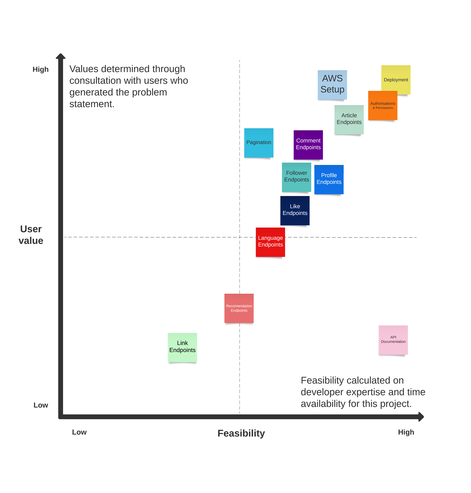
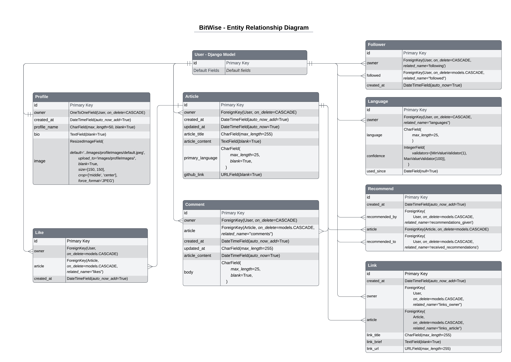

# BitWise - API

# Table Of Contents

- [Bitwise Site Links](#bitwise-site-links)
  - [Live API](#live-api)
  - [Live BitWise Site](#live-bitwise-site)
  - [Frontend Repo](#frontend-repo)
- [Bitwise Backend Overview](#bitwise-backend-overview)
  - [Project Introduction](#project-introduction)
- [Project Planning](#project-planning)
  - [Problem Statement](#problem-statement)
  - [API Objectives](#api-objectives)
  - [User Stories](#user-stories)
  - [Priority Matrix]
  - [Entity Relationship Diagram]
- [API Build]
  - [Models]
  - [Views]
  - [Serializers]
  - [CRUD - Endpoint Map]
- [Further Development]
- [Technologies Used]
  - [Languages Used]
  - [Frameworks Used]
  - [Libraries Used]
  - [Developer Tools]
- [Testing]
  - [Testing Document]
  - [Further Testing]
  - [Development Bugs]
  - [Key Learns]
- [Deployment]
  - [Deployment Document]
- [Credits]
  - [Development Resources]
  - [Media and Content Resources]
  - [Acknowledgements]

 

# Bitwise Site Links

## [Live API](https://bitwise-code-blog.herokuapp.com/#languages-update)

## [Live BitWise Site](https://bit-wise-front-end.vercel.app/)

## [Frontend Repo](https://github.com/Joe-Collins-1986/BitWise-Front-End)

 

# Bitwise Backend Overview

## Project Introduction

**Note:** For the purpose of this project a fictitious client has been generated to provide scope for:

- testing my API devlopment utilising Python through the use of a Django REST Framework (DRF).
- testing my Frontend development utilising HTML, CSS and JavaScript through the use of React (for more information on the frontend development visit my [BitWise Frontend Repo](https://github.com/Joe-Collins-1986/BitWise-Front-End))

The backend for this BitWise project has been developed with Django Rest Framework (DRF) for generation of an API. It provides various endpoints for user authentication, profile management, article handling, comments, likes, and more.

These endpoints will by utilised by the frontend application for development of a site where users post coding articles to the programming community.

Following discussions with the client this site will initially be tailored to written articles with the potential to expand to video uploads, live streaming and purchasable tutorials.

    

# Project Planning

## Problem Statement

The client wishes to develop a social sharing platform targetted towards the programming community.

The developer worked with the client and focus groups consisting of programmers with varying levels of experience to establish the following problem statement. This was then used to establish some basic considerations which could be taken forward into a mind mapping session.

 
If you have a LucidChart account, you can also view this Problem Statement [here](https://lucid.app/lucidspark/ddcc77ae-81e5-48bb-a143-1d8d08517e84/edit?page=0_0&invitationId=inv_33957d7f-3414-4f5b-afb7-62686062836a#).
 

## API Objectives

    
Backend Requirements

The client wants a well structured backend with strong security and an administration panel allowing superusers CRUD functionality withing pre-built models to aide front end testing and API maintainance.

- Django REST authorisation established.
- SessionAuthentication for development and testing of DRF
- Permissions built for API CRUD.
- Development and Live databases set up.
- Static files and images housed on cloud server and linked to backend.
- API documentation developed to detail API endpoints and CRUD setup.

---

    
Frontend Requirements

The client wants the frontend developer to have JWT authorisation, access to all the required serialized data for the established models as well as query filters set up.

- Frontend granted access to make axios requests to API.
- JWTCookieAuthentication for external front end site.
- Models meet front end requirements.
- CRUD functionality meet front end requirements.
- Serializers built to pass appropriate data to endpoints used on interface.
- Error messages presented back through API for duplication attempts.
- Filters built to restrict quuery sets requested.
- Paginated API results to reduce payload requirements.

---

   

## User Stories

All User Stories are detailed on my GitHub account as issues [here](https://github.com/Joe-Collins-1986/BitWise-DRF/issues?q=is%3Aissue+is%3Aclosed). 

These also breakdown:

- Tasks required for each User Story completion.
- Acceptance Criteria for each User Story.

    

        
Example

  

    

## Priority Matrix

The below graphs map out the feasibility of the backend features considered against the user value they provide to help establish the priority they have as part of the build.

    
High Level Priority Matrix

 

    
Detailed Priority Matrix

 

If you have a LucidChart account, you can also view this priority matrix [here](https://lucid.app/lucidspark/0daa104b-7056-4351-b4f9-e2e77701b480/edit?viewport_loc=769%2C650%2C6475%2C6256%2C0_0&invitationId=inv_e5bb265c-e341-41fd-9c04-266266ad9a61).
 

## Entity Relationship Diagram

The below demonstrates the API models and their attributes as well as documenting how they interact.

 

If you have a LucidChart account, you can also view this functions flow [here](https://lucid.app/lucidchart/9582ec18-126e-4b88-b601-011cb64f6e74/edit?viewport_loc=121%2C-170%2C1656%2C1932%2C0_0&invitationId=inv_0eff3f1b-ba36-4160-a99a-1fa7881fa18a).
 

# API Build

## Models

## Views

## Serializers

## CRUD - Endpoint Map

    
CRUD Table

| TOPIC     | URL                            | LIST/READ (GET)   | CREATE (POST)                                                                         | UPDATE (PUT) | PARTIAL UPDATE (PATCH) | DELETE (DELETE) | OVERALL  |
| --------- | ------------------------------ | -------------------- | ---------------------------------------------------------------------------------------- | --------------- | ------------------------- | ------------------ | -------- |
| AUTH      | /dj-rest-auth/registration/    | ❌                   | ✅                                                                                       | ❌              | ❌                        | ❌                 | C        |
| AUTH      | /dj-rest-auth/login/           | ❌                   | ✅                                                                                       | ❌              | ❌                        | ❌                 | C        |
| AUTH      | /dj-rest-auth/logout/          | EXISITS BUT NOT USED | ✅                                                                                       | ❌              | ❌                        | ❌                 | C (USED) |
| AUTH      | /dj-rest-auth/user/            | ✅                   | GENERATED ON REGISTRATION.                                                               | ✅              | ✅                        | ❌                 | RU       |
| AUTH      | /dj-rest-auth/password/change/ | ❌                   | ✅                                                                                       | ❌              | ❌                        | ❌                 | C        |
| AUTH      | /dj-rest-auth/token/refresh/   | ❌                   | ✅                                                                                       | ❌              | ❌                        | ❌                 | C        |
|           |
| ARTICLES  | /articles/                     | ✅                   | ✅                                                                                       | ❌              | ❌                        | ❌                 |          |
| ARTICLES  | /articles/{id}/                | ✅                   | ❌                                                                                       | ✅              | ✅                        | ✅                 | CRUD     |
|           |                                |                      |
| COMMENTS  | /comments/                     | ✅                   | ✅                                                                                       | ❌              | ❌                        | ❌                 |          |
| COMMENTS  | /comments/{id}/                | ✅                   | ❌                                                                                       | ✅              | ✅                        | ✅                 | CRUD     |
|           |                                |                      |                                                                                          |                 |                           |                    |          |
| PROFILES  | /profiles/                     | ✅                   | AUTO GENERATED ON USER REGISTRATION VIA SIGNAL. NO ABILITY TO CREATE VIA API SUBMISSION. | ❌              | ❌                        | ❌                 |          |
| PROFILES  | /profiles/{id}/                | ✅                   | ❌                                                                                       | ✅              | ✅                        | ❌                 | RU       |
|           |                                |                      |                                                                                          |                 |                           |                    |          |
| FOLLOWERS | /followers/                    | ✅                   | ✅                                                                                       | ❌              | ❌                        | ❌                 |          |
| FOLLOWERS | /followers/{id}/               | ✅                   | ❌                                                                                       | ❌              | ❌                        | ✅                 | CRD      |
|           |                                |
| LANGUAGES | /languages/                    | ✅                   | ✅                                                                                       | ❌              | ❌                        | ❌                 |          |
| LANGUAGES | /languages/{id}/               | ✅                   | ❌                                                                                       | ✅              | ✅                        | ✅                 | CRUD     |
|           |                                |
| LIKES     | /likes/                        | ✅                   | ✅                                                                                       | ❌              | ❌                        | ❌                 |          |
| LIKES     | /likes/{id}/                   | ✅                   | ❌                                                                                       | ❌              | ❌                        | ✅                 | CRD      |

**Note:** Additional endpoints exist for auth functionality. Only detailed ones used. 
For further insight into endpoinds see API ducmentation [link](https://bitwise-code-blog.herokuapp.com/#)

- Website used to convert excel to markdown: [here](https://tabletomarkdown.com/convert-spreadsheet-to-markdown/)
- Website used to convert back to excel incase updates required: [here](https://tableconvert.com/markdown-to-excel)

