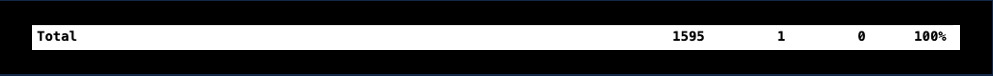

# Testing

Back to Readme [here](README.md)

# Table Of Contents

- [Python Unit Testing](#python-unit-testing)
- [Python Validation Testing](#python-validation-testing)
- [User Testing](#user-testing)

 

---

## Python Unit Testing

Unit Testing coverage rounded to 100%.

 
See below for details on each app:

      
Article App

   
Article app covered to 100%:

 

---

      
Bitwise App

   
Bitwise app covered to 100%:

 

---

      
Comment App

   
Comment app covered to 100%:

 

---

      
Follower App

   
Follower app covered to 100%:

 

---

      
Language App

   
Language app covered to 100%:

 

---

      
Like App

   
Like app covered to 100%:

 

---

      
Profile App

   
Profile app covered to 100%:

 

---

## Python Validation Testing

      
Article

 

Admin:

---

Models:

---

Views:

---

Serializers:

---

URLs:

---

      
Article Tests

 

Models:

---

Views:

---

Serializers:

---

